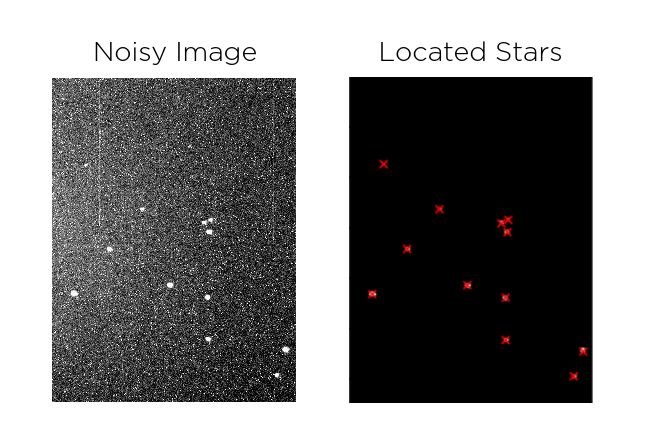
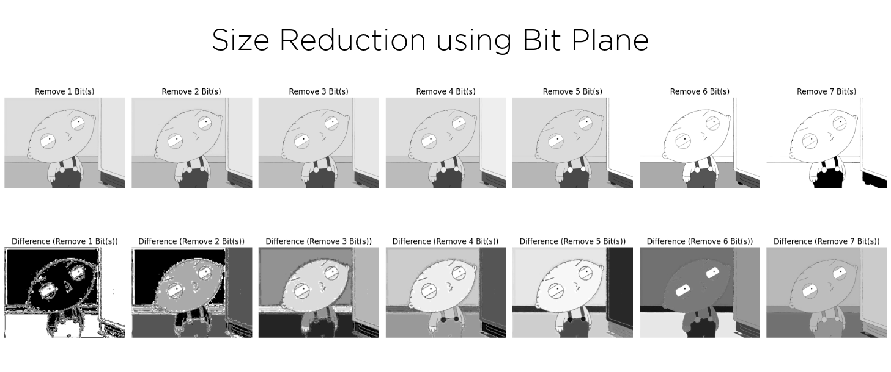
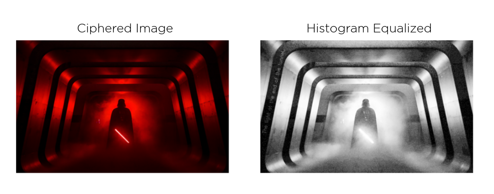

# Classic Image Processing 🚀

Welcome to the **Classic Image Processing** repository! This collection of Jupyter Notebooks showcases various fascinating techniques in the realm of image processing, including:

## 📍 Stars Pinpointing  
  
**Key Techniques Explored:**  
- Preprocessing a noisy sky image to identify and pinpoint stars using classic image processing techniques.

---

## 🔍 Classic OCR  
  
**Key Techniques Explored:**  
- Image preprocessing and text extraction from images using traditional methods like Tesseract.

---

## 🖼️ Image Compression  
  
**Key Techniques Explored:**  
- Demonstrating basic principles of image compression using lossless and lossy techniques.

---

## 🕵️ Steganography with Histogram Equalization  
  
**Key Techniques Explored:**  
- Hiding secret messages within images while applying histogram equalization for visual consistency.

---

Feel free to explore the notebooks and gain insights into the magic of image processing. Contributions and suggestions are always welcome! ✨
